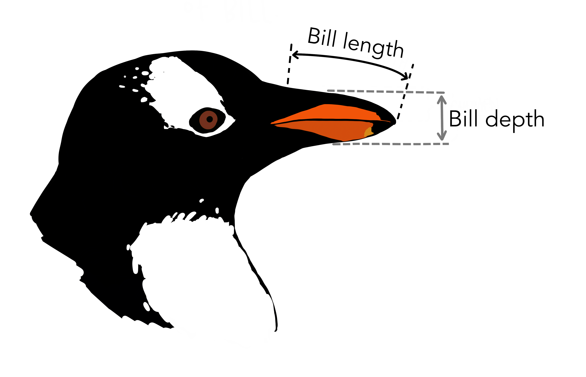
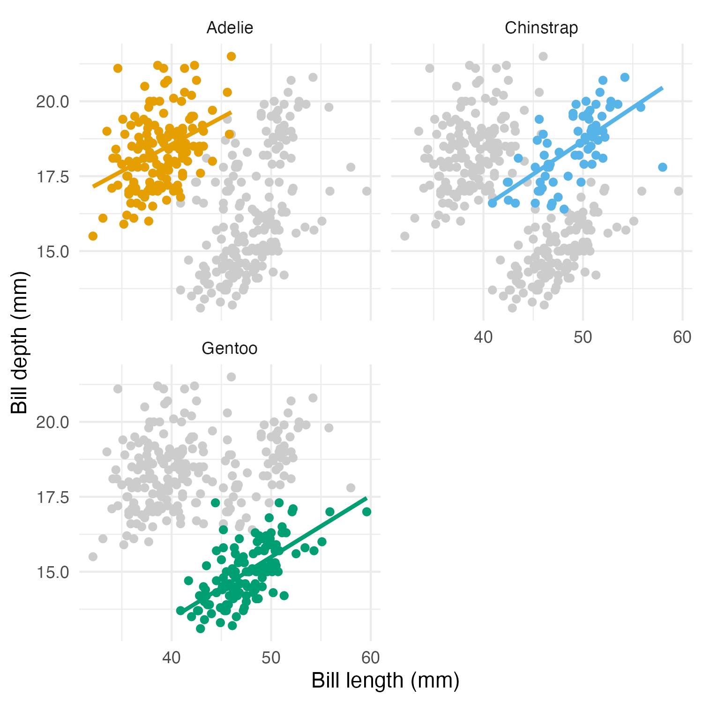

```{r setup, include=FALSE}
knitr::opts_chunk$set(echo = TRUE, error = F, message = F, warning = F)
```

```{r libraries, include=FALSE, message=FALSE, warning=FALSE}
# package for convenience functions (e.g. ggplot2, dplyr, etc.)
library(tidyverse)

# use the minimal theme for plotting
ggplot2::theme_set(ggplot2::theme_minimal())

# global color scheme / non-optimized
project_colors = c("#E69F00", "#56B4E9", "#009E73", "#F0E442", "#0072B2", "#D55E00", "#CC79A7", "#000000")

# setting theme colors globally
scale_colour_discrete <- function(...) {
  scale_colour_manual(..., values = project_colors)
}
scale_fill_discrete <- function(...) {
   scale_fill_manual(..., values = project_colors)
}

# nicer global knitr options
knitr::opts_chunk$set(warning = FALSE, message = FALSE,
                      cache = FALSE, fig.align = 'center')
```

# Instructions

* If you need help, take a look at the suggested readings in the lecture, make use of the [cheat sheets](https://rstudio.com/resources/cheatsheets/) and the help possibility in R.
* Make sure you have R and RStudio installed. If you are an advanced user and aren't using RStudio, make sure you have everything installed in order to 'knit' the HTML output.
* In the 'author' heading of the Rmd file, write your group members' last names and answer the following questions.
* When all answers are ready, 'Knit' the document to produce a HTML file.
* Create a ZIP archive called "IDA_HW02-Last-names.zip" ('Last-names' are all members in the group as written in the 'author') containing:
   * an R Markdown file "IDA_HW02-Last-names.Rmd"
   * a knitted HTML document "IDA_HW02-Last-names.html"
   * any other files necessary to compile your Rmarkdown to HTML (pictures etc.)
* Upload the ZIP archive on Stud.IP in your group folder before the deadline (see above). You may upload as many times as you like before the deadline, only your final submission will count.

# <span style = "color:firebrick">Exercise 1:</span> Explore the data [10 points]


## Ex 1.a Load and explore the dataset [1 point]

<!-- 0.5 point deduction for not renaming the column names / not using `head()` and `tail()` functions -->

Load the "Frontiers 2019 adultchild exp 1.csv" dataset. Rename the column `subject exp` to `subject_id`, `property.type` to `property_type`, and `item.no` to `item_no`. 

Use R to take a look at the first and last 5 rows of the dataset.

```{r, eval = FALSE}
frontiers <- read_csv("Frontiers 2019 adultchild exp 1.csv")
colnames(frontiers) <- ...

head(...)
tail(...) 
```

```{r}
# your code here
```

**Solution:**

```{r}
frontiers <- read_csv("Frontiers 2019 adultchild exp 1.csv")
colnames(frontiers) <- c("subject_id", "gender",
                         "age", "list", "property_type",
                         "item_no", "statement", "response")
rbind(
  head(frontiers, 5),
  tail(frontiers, 5)
)
```

## Ex 1.b Global summary statistics [2 points]

<!-- one point deduction for not calculating unique entries in the `subject_id` column -->

Use R to display the following information:

  * the number of rows in the dataset;
  * the number of unique entries in the `subject_id` column. 
  
**Hint:** Take a look at the `pull()`, `unique()` and `length()` functions. You can make use of the piping `|>`.

```{r}
# your code here
```

**Solution:**

```{r}
nrow(frontiers)

frontiers |>
   pull(subject_id) |>
   unique() |>
   length()
```

## Ex 1.c Grouped summary statistics [2 points]

<!-- one point deduction for not calculating mean percentages -->

Calculate the mean (in percentages) of "yes" answers for `adult` and `child`. 

**Hint:** Make use of `group_by()`, `summarize()` and `mutate()` functions.

```{r}
# your code here
```

**Solution:**

```{r}
frontiers |>  
  group_by(age) |> 
  summarize(mean_yes = mean(response == 1)) |> 
  mutate(percent_yes = mean_yes * 100)
```

## Ex 1.d Property extensions [5 points]

<!-- 1.5 point deduction for not calculating the standard error -->

Calculate the mean percentages of property extensions per condition (`neutral`, `striking`) per age group (`adult`, `child`). Plot the results using `geom_bar()` and `geom_errorbar()`. 

**Hint:** Take a look at Figure 2 from [Lazaridou-Chatzigoga et al. (2019)](https://doi.org/10.3389/fpsyg.2019.01971) paper.

```{r, eval = FALSE}
frontiers |>
  group_by(...) |>
  summarise(...) |>
  ggplot(aes(...)) +
  geom_bar(...) +
  geom_errorbar(aes(...),
                  width=.2,                    
                  position=position_dodge(.9)) + 
  labs(...) +
  theme_classic() +
  theme(plot.title = element_text(hjust = 0.5)) +
  scale_color_manual(values=c('#999999','#E69F00'))
```

```{r}
# your code here
```

**Solution:**

This solution shows how to use the `scales` library as one of the ways to show the values on the $y$-axis in percent.

```{r}
# To have percent on the y-axis, you can use the library `scales`
require(scales)

frontiers |>
  group_by(property_type, age) |>
  summarise(percent = mean(response),
            s_error = sd(response) / sqrt(length(response))) |> # standard error
  ggplot(aes(x = age, y = percent, fill = property_type)) +
  geom_bar(position = position_dodge(), stat = "identity") +
  geom_errorbar(aes(ymin = percent - s_error, ymax = percent + s_error),
                width = .2,
                position = position_dodge(.9)) +
  labs(title = "Mean percentage of property extensions",
       x     = "Age group",
       y     = "Percentage of property extensions",
       fill  = "Property type") +
  theme_classic() +
  theme(plot.title = element_text(hjust = 0.5)) +
  scale_y_continuous(labels = scales::label_percent())
```

# <span style = "color:firebrick">Exercise 2:</span> Riddle on Average [5 points]

## Ex 2.a [5 points]

<!-- tend to give full points as long as their answer makes sense; otherwise deduct up to 3.5 points in case an elaborate answer is given but is hardly relevant or wrong -->

Let's consider a scenario where in the last 10 years:

* 100 countries in the world increased their energy consumption by 8% per country.
* 100 countries in the world decreased their energy consumption by 10% per country.

The International Energy Association is interested in the percentage change across all 200 countries. Would the following conclusion be accurate: the energy consumption is decreased by |(8+(-10)/2| = 1% per country?

**Your answer here:**

**Solution:** 

> The calculation would make sense if the raw amount of energy used in each country was the same. However, some countries use far more energy than other countries. 
> For instance, let's imagine the 100 countries that increased their energy consumption were all developed countries with large populations that already use a lot of energy.The percentage increase would result in a lot more energy usage. 
> Now let's imagine the 100 countries that decreased their energy consumption were all developing countries with small populations that barely used any energy before. The percentage decrease would not have as big of an effect. 
> It makes sense to be careful when calculating means with percentage change. One cannot always simply average the percentages because the initial amount matters.

# <span style = "color:firebrick">Exercise 3:</span> Exploring two-dimensional metric measurements [15 points]



We are now going to practice plotting and analyzing metric data from more than one variable. To do this, we will use the Palmer Penguins dataset created by Allison Horst. Install the `palmerpenguins` package by running the code chunk below.

```{r, eval = FALSE}
install.packages("palmerpenguins")
```

The penguins data can now be accessed by calling the `penguins` variable.

```{r}
library(palmerpenguins)
glimpse(penguins)
```

## Ex 3.a Calculate the correlation score [3 points]

The `penguins` data contains size measurements for penguins who live on three islands in the Palmer Archipelago, Antarctica. Use R's built-in function `cor()` to compute the Bravais-Pearson correlation between the variables `bill_length_mm` and `bill_depth_mm`. Notice that you must first remove all entries in either column with missing data.

```{r}
with(penguins |> filter(!is.na(bill_length_mm) & !is.na(bill_depth_mm)), cor(bill_length_mm, bill_depth_mm))
# or
cor(penguins$bill_length_mm, penguins$bill_depth_mm, use = "complete.obs")
```

## Ex 3.b Interpret a correlation score [1 point]

<!-- almost any textual description is fine; no causal language -->

**Your answer here:**

> There appears to be a mild negative correlation between bill depth and bill length, so that larger values of bill length correspond to smaller values of bill depth.

## Ex 3.c Compute correlation scores for each penguin species [3 points]
<!-- almost any textual description is fine; mention of Simpson's paradox is optional -->

For each data point, the column `species` contains the information about which penguin species the measurement belongs to. Use R's built-in function `cor()` to compute the Bravais-Pearson correlation between the variables the variables `bill_length_mm` and `bill_depth_mm` separately for each penguin species.

Use `group_by()` and remember to remove missing values.

Is there anything unusual about the correlation scores calculated separately for each species? (Write one or two sentences about what you observe.)

```{r, eval = FALSE}
penguins |>
  filter(...) |>
  group_by(...) |>
  summarize(
    correlation = ...
  )
```

**Solution:**

<!-- NAs should be removed only for `bill_length_mm` and `bill_depth_mm` -->

```{r}
penguins |>
  filter(!is.na(bill_length_mm) & !is.na(bill_depth_mm)) |>
  group_by(species) |>
  summarize(
    correlation = cor(bill_length_mm, bill_depth_mm)
  )
```

**Your answer here:**

> When data are subsetted by species, the correlation score changes sign: now there is a positive correlation between bill length and bill width. This is known as [Simpson's paradox](https://learningstatisticswithr.com/book/why-do-we-learn-statistics.html#the-cautionary-tale-of-simpsons-paradox).

## Ex 3.d Make a scatter plot [3 points]

<!-- one point deduction if `se = FALSE` is missing from geom_smooth() -->

Create a scatterplot (using `geom_point()`) showing `bill_length_mm` on the $x$-axis and `bill_depth_mm` on the $y$-axis. Add a linear regression line using `geom_smooth()`. Check the documentation of `geom_smooth()` to find an option that suppresses the gray area around the regression line (which is a confidence interval; confidence intervals will be introduced later in the course). Finally, adjust the axis labels so that they say "Bill length (mm)" and "Bill depth (mm)", and a plot title.

```{r}
# your code here
```

**Solution:**

```{r}
penguins |>
  ggplot(aes(x = bill_length_mm,
             y = bill_depth_mm)) +
  geom_point() +
  labs(title = "Penguin bill dimensions",
       x = "Bill length (mm)",
       y = "Bill depth (mm)") +
  geom_smooth(method = "lm", se = FALSE)
```

## Ex 3.e Make a scatter plot facetted by species [2 points]

<!-- one point deduction if `scales = "free"` is missing -->

Use `facet_wrap()` to make three nicely arranged scatter plots, one for each level of `species`, with `bill_length_mm` on the $x$-axis, and `bill_depth_mm` on the $y$-axis (as before: with linear regression lines without confidence intervals and nice axis labels). Make sure that each facet has its own range of values shown for the $x$ and $y$-axis, using the `scales` option of `facet_wrap()`.

**Solution:**

```{r}
penguins |>
  ggplot(aes(x = bill_length_mm,
             y = bill_depth_mm)) +
  geom_point() +
  labs(x = "Bill length (mm)",
       y = "Bill depth (mm)") +
  geom_smooth(method = "lm", se = FALSE) +
  facet_wrap(species ~., scales = "free")
```

## Ex 3.f Plot all data in the background of each panel [3 points]

<!-- most important is understanding of layers in ggplot, and how to provide different
data to different geoms
-->

To compare measurements of the three penguin species, it may be useful to plot the full data in the background of each panel, and use colour to highlight just one species' data in each panel. Use `facet_wrap()` to create a plot that looks similar to the one below:



```{r}
# your code here
```

**Solution:**

```{r}
penguins_pooled <- dplyr::select(penguins, -species)

penguins |> ggplot(aes(x = bill_length_mm,
                       y = bill_depth_mm)) +
  geom_point(data = penguins_pooled,
             colour = "grey80") +
  geom_point(aes(colour = species)) +
  geom_smooth(aes(colour = species),
              method = "lm", se = FALSE) +
  facet_wrap(species ~ ., nrow = 2) +
  labs(x = "Bill length (mm)",
       y = "Bill depth (mm)") +
  theme(legend.position = "none")
```

