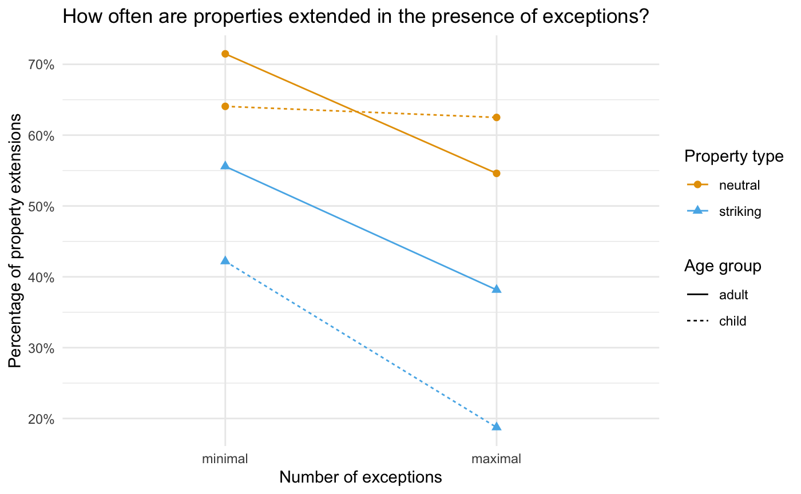

```{r setup, include=FALSE}

knitr::opts_chunk$set(echo = TRUE, error = F, message = F, warning = F)

```

```{r libraries, include=FALSE, message=FALSE, warning=FALSE}

# package for convenience functions (e.g. ggplot2, dplyr, etc.)
library(tidyverse)
library(scales)

# use the minimal theme for plotting
ggplot2::theme_set(ggplot2::theme_minimal())

# global color scheme / non-optimized
project_colors = c("#E69F00", "#56B4E9", "#009E73", "#F0E442", "#0072B2", "#D55E00", "#CC79A7", "#000000")

# setting theme colors globally
scale_colour_discrete <- function(...) {
  scale_colour_manual(..., values = project_colors)
}
scale_fill_discrete <- function(...) {
   scale_fill_manual(..., values = project_colors)
} 

# nicer global knitr options
knitr::opts_chunk$set(warning = FALSE, message = FALSE, 
                      cache = TRUE, fig.align = 'center')
```

# Instructions

* Create an Rmd file with the names of your group members in the 'author' heading and answer the following questions.
* When all answers are ready, 'Knit' the document to produce a HTML file.
* Create a ZIP archive called "IDA_HW04-names.zip" (where %names% are the last names of all members in the group as written in the 'author' field) containing:
   * an R Markdown file "IDA_HW04-names.Rmd"
   * a knitted HTML document "IDA_HW04-names.html"
   * any other files necessary to compile your Rmarkdown to HTML (data, pictures etc.)
* Upload the ZIP archive on Stud.IP in your group folder before the deadline (see above). You may upload as many times as you like before the deadline, only your final submission will count.

# <span style = "color:firebrick">Exercise 1:</span> Contrast coding [16 points]

The purpose of this exercise is to better understand coding schemes for categorical factors. We also would like you to get more comfortable with testing hypotheses about regression coefficients.
You will construct and implement **Treatment coding** using the regression model to test hypotheses about the [survey data](https://r-data.pmagunia.com/dataset/r-dataset-package-mass-survey) In particular, we are interested in the effect of smoking habits on height. 


## Ex 1.a Preprocess data [2 points]

`student-survey-data.csv` contains height measurements of 237 students at the University of Adelaide, as well as other self-reported data such as gender, age, and smoking habits. Read the dataset into R by running the code chunk below:

```{r}
survey_data <- read_csv("student-survey-data.csv")
glimpse(survey_data)
```

Convert the `Smoke` variable in the `survey_data` dataframe to a factor. Remove rows with missing values for the `Height` variable.

**Solution:**

```{r}
# cast `Smoke` to factor from character 
survey_data$Smoke <- as.factor(survey_data$Smoke)
```

```{r}
# drops na in "Height" col -- data from 237 entries to 209
survey_data <- 
  survey_data  |> 
    drop_na(Height)
```


## Ex 1.b Re-order levels of a factor variable [2 points]

Re-order the levels of the `Smoke` factor in the `survey_data` dataframe so that "Never" is the first, and the rest are ordered as follows:
`Never`, `Occas`, `Regul`, `Heavy`.

**Solution**

```{r}
# We can use `fct_relevel` from the `forcats` package for this task.

survey_data$Smoke <- forcats::fct_relevel(survey_data$Smoke, "Never", "Occas","Regul", "Heavy")
levels(survey_data$Smoke)
```


## Ex 1.c Visualise the data [3 points]

Create a boxplot to compare the heights of individuals based on their smoking habits. Incorporate the information about the average height in each group into this plot. 

**Hint:** You can use `stat_summary()` to add the means of each group to the plot.

**Solution:**

```{r}
survey_data |> 
  ggplot(aes(x = Height, y = Smoke)) +
  geom_boxplot() +
  stat_summary(fun.x = mean, geom = "point",
               shape = 20, size = 4, color = "red", fill = "red")
```

## Ex 1.d Get the empirical differences between means [2 points]

Calculate the difference in mean height between the "Never" group and the other groups (Never vs Occas, Never vs Regul, and Never vs Heavy).

**Solution:**

```{r}

mean_heights <- survey_data %>% group_by(Smoke) %>% 
  summarize(mean = mean(Height)) %>% pull(mean)

# same as above!
tapply(survey_data$Height, survey_data$Smoke, FUN = mean)

print(paste(round(mean_heights[1] - mean_heights[2], 4), "is Never - Occas"))
print(paste(round(mean_heights[1] - mean_heights[3], 4), "is Never - Regul"))
print(paste(round(mean_heights[1] - mean_heights[4], 4), "is Never - Heavy"))

```


## Ex 1.e Build the predictor matrix [2 points]

Complete the table below so that it shows **Treatment coding** for the four levels of `Smoke` in the `survey_data` (as shown in slide 41 of `IDA_10_Regression.pdf` for two levels). 

**Treatment Coding**
```{r, eval = F}
block     x_0     x_1     x_2     x_3

"Never"   
"Occas"  
"Regul"   
"Heavy"   
   
```

**Solution:**
```{r, eval = F}
block     x_0     x_1     x_2     x_3

"Never"   1       0       0       0
"Occas"   1       1       0       0 
"Regul"   1       0       1       0
"Heavy"   1       0       0       1
   
```


## Ex 1.f Fit a regression model [2 points]

Use `survey_data` to fit a linear regression model that predicts `Height` in terms of the value of `Smoke`.


```{r, eval = F}
model <- … 
```

**Solution:**

```{r}
model <- lm(Height ~ Smoke, data=survey_data)
```


## Ex 1.g Explain the output of `summary(model)` [3 points]

Briefly explain the output of `summary(model)`.

```{r}
summary(model)
```
**Solution:**
> The amount of variance explained by the model is very small (the value of adjusted $R^2$ is only 0.007), which indicates that we are missing important factors influencing one's height. The high $p$-value associated with the F statistic is another indication that this is not a good model for predicting people's heights. The three estimated coefficients show the change in mean height in comparison with the reference level (non-smokers). All are positive. Only `SmokeRegul` is statistically significant at the 5% level.

# <span style = "color:firebrick">Exercise 2:</span> Analyzing generalisations of striking properties [20 points]

The purpose of this exercise is to practice fitting a logistic regression model with interaction terms and random effects.

Thanks to Dimitra Lazaridou-Chatzigoga, we have experimental data from a linguistic study that compared how frequently children and adults extend striking vs. neutral properties of objects ([you can access the paper here]( https://doi.org/10.3389/fpsyg.2019.01971)).


Following Lazaridou-Chatzigoga et al. (2019), we will investigate the following research question:

- **"Sensitivity to number of exceptions":** The greater the number of the exceptions, the lower the property extension rates, for both neutral and striking properties.

Load the data from Lazaridou-Chatzigoga et al.'s second experiment as follows:

```{r}
frontiers <- read_csv("Frontiers 2019 adultchild exp 2.csv")
colnames(frontiers) <- c("subject_id", "gender",
                         "age", "list", "property_type",
                         "exception_type", "condition",
                         "item_no", "statement", "response")
glimpse(frontiers)
```

## Ex 2.a Clean the data [1 point]

<!-- 1 points -->

Remove the rows where no valid response was given. Use R code to output a message about how many rows were excluded.

**Solution:**

```{r, message = TRUE}
message("There are ", sum(is.na(frontiers$response)) , " invalid responses in the dataset.")

frontiers <- frontiers |> 
  filter(!is.na(response))
```


## Ex 2.b Plot the data [4 points]

Plot the percentage of property extensions for minimal vs. maximal exceptions condition with the help of `geom_point` and `geom_line`, using colours and shapes to distinguish between children and adults, and striking and neutral statements.

The resulting plot should look like this:



**Solution:**

```{r}
library(scales)
frontiers |>
  group_by(condition, age, exception_type, property_type) |> 
  summarize(mean_yes = mean(response == 1)) |> 
  ungroup() |> 
  ggplot(aes(fct_reorder(exception_type, mean_yes, .desc = T),
             mean_yes, group = interaction(property_type, age))) +
  geom_point(aes(color = property_type, shape = property_type),
             size = 2) +
  geom_line(aes(color = property_type,
                linetype = age)) +
  labs(x        = "Number of exceptions",
       y        = "Percentage of property extensions",
       colour   = "Property type",
       shape    = "Property type",
       linetype = "Age group",
       title    = "How often are properties extended in the presence of exceptions?") +
  scale_y_continuous(labels = percent)
```

## Ex 2.c Run a logistic regression model [5 points]

Run a logistic regression model on the cleaned data, predicting `response` in terms of categorical variables `age`, `property_type` and `exception_type`. Include random intercepts for `subject_id` and `statement`.

Briefly explain the output of `summary(model)`.

**Solution:**

```{r}
library(lme4)

model <- glmer(
  formula = response ~ age + property_type + exception_type +
    (1 | subject_id) + 
    (1 | statement),
  family = binomial(link = "logit"), data = frontiers)
summary(model)
```

> The output of `summary(model)` includes statistics that describe the quality of fit of the model to the data, and the coefficients of fixed and random effects included in the model. The negative coefficient of `property_typestriking` indicates that stiking properties are less likely to be extended in comparison to the reference level (neutral properties). Conversely, statements with the minimal number of exceptions are shown to result in more property extensions.

## Ex 2.d Include an interaction term [5 points]

Fit a model that includes an interaction between `property_type` and `exception_type`. What can you say about this interaction based on the output of `summary(model)`?

**Solution:**

```{r}

model_int <- glmer(
  formula = response ~ age + property_type * exception_type +
    (1 | subject_id) + 
    (1 | statement),
  family = binomial(link = "logit"), data = frontiers)

summary(model_int)
```

> The interaction between property type and exception type is not statistically significant.

## Ex 2.e Include random slopes [5 points]

Fit a model that includes random slopes for property type, exception type, age, and property type. Interpret the output of `summary(model)`.

**Solution:**

```{r}
model_slopes <- glmer(
  formula = response ~ age + property_type + exception_type +
    (property_type + exception_type | subject_id) + 
    (age + property_type + exception_type | statement),
  family = binomial(link = "logit"), data = frontiers)

summary(model_slopes)
```

> The effects of property type and exception type are shown to be significant. In the table with random effects, the fourth column displays the correlation between the by-subject random intercepts and slopes for the effects of property type and exception type, and by-statement random intercepts and slopes for the effects of age, property type and exception type.

**References**

Lazaridou-Chatzigoga D, Katsos N and Stockall L (2019) Generalizing About Striking Properties: Do Glippets Love to Play With Fire? Front. Psychol. 10:1971. doi: 10.3389/fpsyg.2019.01971
